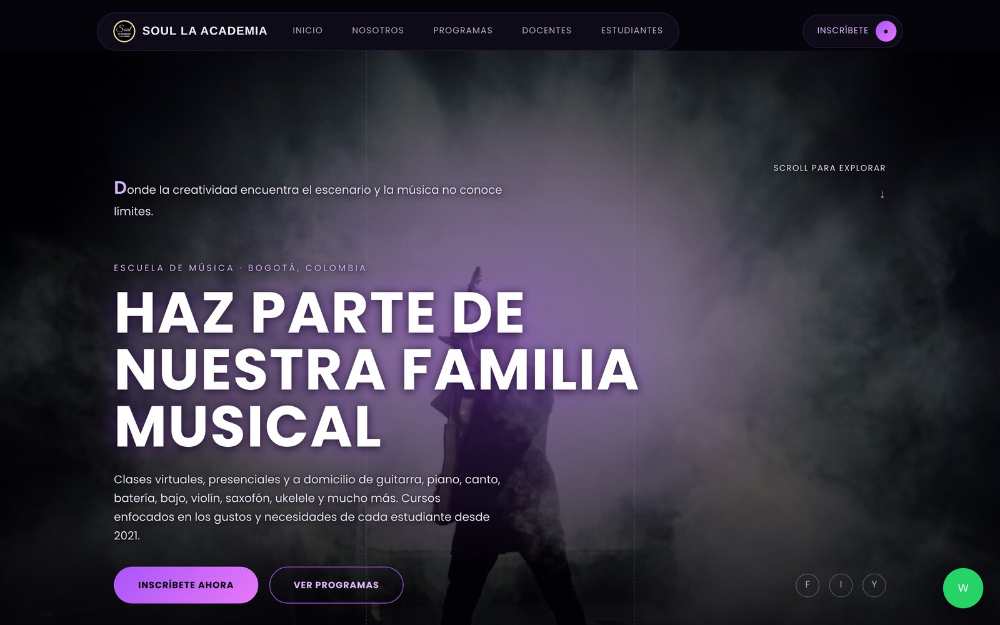
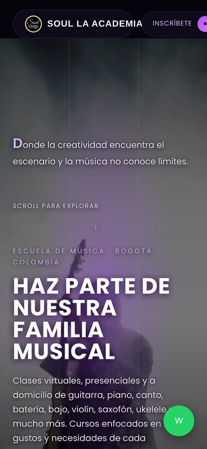

<div align="center">


# Soul La Academia

**Sitio web oficial de Soul La Academia — escuela de música en Bogotá, Colombia.**

[](https://sergiocorrea88.github.io/soul-la-academia/)
[](#stack-técnico)
[](#stack-técnico)
[](#stack-técnico)
[](LICENSE)

**[→ Ver el sitio](https://sergiocorrea88.github.io/soul-la-academia/)**

</div>

---

## Vista previa

<div align="center">
  
  <br><br>
  
</div>

---

## Sobre el proyecto

Soul La Academia es una escuela de música que opera en Bogotá desde 2021, con
clases virtuales, presenciales y a domicilio. Este repositorio contiene el sitio
web institucional: presenta la oferta académica, el equipo docente y canaliza las
inscripciones directamente a WhatsApp.

Está construido como **sitio estático puro**: sin frameworks, sin backend y sin
proceso de compilación. La decisión es deliberada — el contenido cambia poco, el
formulario no necesita base de datos y así el hosting es gratuito, el sitio carga
rápido y cualquiera puede mantenerlo editando HTML.

## Características

- **Diseño responsive** — una sola hoja de estilos cubre escritorio, tablet y móvil.
- **Banner rotativo** — tres fotografías con transición suave y zoom lento en CSS puro.
- **Carrusel de instrumentos** — desplazamiento infinito con tarjetas duplicadas marcadas `aria-hidden` para no duplicar el contenido ante lectores de pantalla.
- **Formulario de inscripción sin backend** — valida los campos con la API nativa del navegador y arma un mensaje prellenado de WhatsApp.
- **Fichas de docentes** — resumen en la portada y biografía completa en página aparte, enlazadas por ancla.
- **SEO y redes** — meta etiquetas Open Graph y Twitter Card para que el enlace se vea bien al compartirlo, más datos estructurados `schema.org/MusicSchool` para búsqueda local.

## Stack técnico

| Capa | Tecnología | Por qué |
| --- | --- | --- |
| Estructura | HTML5 semántico | Accesibilidad e indexación |
| Estilos | CSS3 con variables personalizadas | Cambiar la paleta se hace en un solo bloque `:root` |
| Imágenes | WebP redimensionado | 77 % menos peso que los JPEG originales |
| Interacción | JavaScript (vanilla, ES5) | Solo dos comportamientos; una librería sería sobrepeso |
| Tipografía | Google Fonts (Rajdhani + Poppins) | — |
| Hosting | GitHub Pages | Gratuito, HTTPS incluido, despliegue en cada `push` |

## Estructura del proyecto

```
soul-la-academia/
├── index.html              Portada: hero, nosotros, programas, docentes, videos, contacto
├── docentes.html           Biografías completas del equipo
├── 404.html                Página de error personalizada
├── css/
│   └── style.css           Todos los estilos (variables de color en :root)
├── js/
│   └── script.js           Menú móvil + formulario → WhatsApp
├── assets/images/          Fotografías (WebP), logo e imagen de vista previa social
├── docs/                   Capturas usadas en este README
├── robots.txt              Indexación para buscadores
├── sitemap.xml             Mapa del sitio
├── CREDITS.md              Origen y licencia de cada imagen
└── LICENSE                 Términos de uso
```

## Ejecutarlo localmente

Al ser un sitio estático, basta con abrir `index.html` en el navegador. Aun así,
lo recomendable es levantar un servidor local: algunos comportamientos (rutas
absolutas, la página 404, los datos estructurados) se comportan como en producción
solo cuando el sitio se sirve por HTTP y no por `file://`.

```bash
# 1. Clonar
git clone https://github.com/Sergiocorrea88/soul-la-academia.git
cd soul-la-academia

# 2. Servidor local — elige una opción

# Python (viene instalado en la mayoría de sistemas)
python -m http.server 8000

# Node.js
npx serve .

# VS Code: extensión "Live Server" → clic derecho en index.html → "Open with Live Server"
```

Luego abre <http://localhost:8000>.

## Despliegue

El sitio se publica con **GitHub Pages** desde la rama `main`. Cada `push` a `main`
actualiza el sitio en vivo en un par de minutos; no hay que ejecutar nada más.

```bash
git add .
git commit -m "feat: descripción del cambio"
git push
```

Configuración en el repositorio: **Settings → Pages → Build and deployment →
Deploy from a branch → `main` / `(root)`**.

El archivo `.nojekyll` le indica a GitHub Pages que publique los archivos tal
cual, sin pasarlos por Jekyll.

## Guía rápida de mantenimiento

| Quiero cambiar… | Archivo | Dónde |
| --- | --- | --- |
| Teléfono o correo | `index.html`, `docentes.html`, `js/script.js` | Buscar `3218951750` y `soullaacademia@gmail.com` |
| Colores de la marca | `css/style.css` | Bloque `:root` (líneas iniciales) |
| Textos de misión / visión | `index.html` | Sección `#nosotros` |
| Programas ofrecidos | `index.html` | Bloque `.program-grid` |
| Agregar un docente | `index.html` + `docentes.html` | Copiar una `.teacher-card` y una `.teacher-full-card`; la foto va en `assets/images/teacher-<nombre>.webp` |
| Videos de conciertos | `index.html` | Sección `#estudiantes`, atributo `src` de los `<iframe>` |
| Instrumentos del carrusel | `index.html` | Bloque `.instrument-track` (recuerda duplicar la tarjeta al final para el bucle) |

> Si cambias el nombre del repositorio o conectas un dominio propio, actualiza las
> URLs absolutas en `index.html`, `docentes.html`, `404.html`, `robots.txt` y
> `sitemap.xml`.

## Mejoras pendientes

- [ ] Reemplazar las seis fotos de Pexels por fotografías reales de clases (ver [CREDITS.md](CREDITS.md)).
- [ ] Sustituir las iniciales de redes sociales (F, I, Y, W) por iconos SVG.
- [ ] Equilibrar la grilla de docentes (cinco fichas en una cuadrícula de cuatro columnas).
- [ ] Conectar un dominio propio (`soullaacademia.com`) y añadir el archivo `CNAME`.
- [ ] Añadir sección de precios y calendario de conciertos.

## Créditos

Ver [CREDITS.md](CREDITS.md) para el origen de imágenes, tipografías y videos.

## Licencia

Código, textos, marca e imágenes son propiedad de Soul La Academia SAS.
Ver [LICENSE](LICENSE).

## Contacto

**Soul La Academia** · Bogotá, Colombia
[WhatsApp](https://api.whatsapp.com/send?phone=573218951750) ·
[soullaacademia@gmail.com](mailto:soullaacademia@gmail.com) ·
[Instagram](https://www.instagram.com/soullaacademia/) ·
[Facebook](https://www.facebook.com/SoulLaAcademia) ·
[YouTube](https://www.youtube.com/@soullaacademia5170)

Mantenido por [@Sergiocorrea88](https://github.com/Sergiocorrea88).
